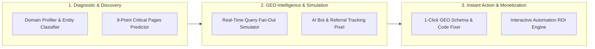

# LLMClicks.ai vs. AIBizMod: Comprehensive Analysis, Feature Teardown & GEO Action Plan

> **Date:** August 24, 2026  
> **Prepared for:** AIBizMod Executive & Engineering Team  
> **Subject:** Strategic Benchmark Analysis of LLMClicks.ai Dashboard & High-Efficiency Roadmap to Upgrade AIBizMod  

---

## 1. Executive Summary

This document provides a deep comparative analysis between **LLMClicks.ai** (`app.llmclicks.ai/dashboard`) and **AIBizMod** (`aibizmod.com`), based on live platform audits and direct dashboard teardowns from user-submitted system screens.

### Core Strategic Finding
- **LLMClicks.ai** is structured as a **pure-play GEO SaaS tracker** with a credit-based subscription model ($49–$159+/mo) and an affiliate/placement marketplace. Its strength lies in structured diagnostics (*Domain Profiler*, *AI Visibility Predictor*, *Query Generator*, *Traffic Tracker*).
- **AIBizMod** has a unique market advantage: it is a **hybrid agency & software engineering platform** equipped with free interactive audit tools (`/ai-visibility-audit-report`, `/tools/llms-txt-generator`, `/ai-visibility-prompts`).
- **The Opportunity for AIBizMod:** By adopting LLMClicks' highest-utility diagnostic modules (*Domain Profiler*, *Expected Pages Predictor*, *Query Fan-Out*, *AI Referral Pixel*) and pairing them with **1-Click Auto-Fixers** (which LLMClicks lacks), AIBizMod can deliver 10x more value, drive massive inbound organic clicks, and capture high-margin agency automation clients.

---

## 2. Visual Teardown: LLMClicks.ai Dashboard Architecture

From the live dashboard screenshots, LLMClicks organizes its capabilities into three distinct layers:

```
LLMCLICKS.AI DASHBOARD ARCHITECTURE
│
├── 1. PROJECT (Core Tracking & Analytics)
│   ├── Home               → Central GEO Health & Score Trends
│   ├── Queries            → Monitored LLM prompts & engine ranks
│   ├── Sources            → Third-party citations powering LLM answers
│   ├── Intent             → Query classification (Transactional / Info / Compare)
│   ├── Page Optimizer     → Semantic density & vector alignment
│   └── Traffic Tracker    → Real-time AI bot & referral analytics (Beta)
│
├── 2. AI MODULES (Interactive Audits & Generation)
│   ├── Instant Audit
│   │   ├── Domain Profiler        → Brand categorization & entity perception (e.g., "SaaS - PM Specialist")
│   │   ├── Visibility Predictor   → 60s readiness check & critical pages scanner (e.g., 4/9 found)
│   │   ├── Brand Audit            → Hallucination monitor & sentiment check
│   │   └── llms.txt Generator     → Spec-compliant llms.txt builder
│   ├── Content Optimizer  → Page-by-page semantic tuning ("My Pages")
│   ├── AI Query Generator → Reverse prompt expansion & PAA simulation
│   ├── YouTube AI Tracker → Video transcript citation monitoring (New)
│   └── Lead Module        → Prospecting tool for marketing agencies
│
└── 3. GENERAL & MONETIZATION
    ├── Browse Marketplace → Buy placements on 1,200+ cited listicles ($640–$1,450)
    ├── My Orders / Inquiries
    └── Credit System      → Tiered usage limits (e.g., "5 of 10 used")
```

---

## 3. Side-by-Side Comparison Matrix

| Feature / Capability | LLMClicks.ai (`app.llmclicks.ai`) | AIBizMod (`aibizmod.com`) | Strategic Gap & Upgrade Path |
|---|---|---|---|
| **Domain Profiling & Entity Detection** | Identifies exact brand type (e.g. `saas_software — project management Specialist`, B2B/B2C). | Evaluates Organization and Person schema presence. | **High Opportunity:** Add explicit AI Brand Persona classification to AIBizMod's audit output. |
| **Critical Pages Check (Visibility Predictor)** | Scans whether AI expects to find 9 essential pages (About, Pricing, Services, Team, FAQs, Case Studies, etc.) scoring e.g. `4/9`. | Audits overall site crawlability and single-page content depth. | **Quick Win:** Add a "9 Essential AI Pages Scanner" to `/ai-visibility-audit-report`. |
| **Audit Delivery Model** | Credit-gated dashboard requiring account creation and upgrade tier. | Instant, frictionless web report with zero signup friction. | **AIBizMod Advantage:** Instant free scan wins top-of-funnel viral traffic and backlinks. |
| **llms.txt Generation** | Interactive generator tool inside dashboard. | Dedicated standalone tool (`/tools/llms-txt-generator`) with instant copy/download. | **AIBizMod Parity/Lead:** Standalone public tool already drives good SEO; add automated sitemap sync. |
| **Traffic & Bot Attribution** | Dedicated "Traffic Tracker (Beta)" logging AI bot hits and referrals. | Standard analytics guidance in action plans. | **Game Changer:** Release a 1-line copy-paste AIBizMod AI Traffic Pixel. |
| **Query Fan-Out & Intent** | AI Query Generator simulating multi-hop search queries with intent tags. | 54 static prompt templates on `/ai-visibility-prompts`. | **High Priority:** Automate prompt generation directly from the audited domain. |
| **Execution & Resolution** | Passive reports (user must hire an engineer or write code themselves). | Full-service automation & dev agency + automated code generators. | **AIBizMod Superpower:** Provide "1-Click Auto-Fix" scripts + agency implementation. |
| **Monetization Model** | Recurring SaaS subscriptions ($49–$159/mo) + listicle link marketplace. | Service contracts ($2k–$20k+) + automated tool funnel. | **Synergy:** Convert free SaaS tool users into high-ticket automation & GEO retainers. |

---

## 4. Detailed Breakdown: Proposed Standout Tools for AIBizMod

To make AIBizMod significantly more powerful and click-generative than LLMClicks, we propose introducing **6 specialized tools** into `aibizmod.com/tools`:



---

### Tool 1: AI Domain Profiler & Entity Classifier
- **Inspired by:** LLMClicks *Domain Profiler*
- **What it does:** Runs real-time prompt probing against ChatGPT, Claude, and Perplexity to determine:
  1. How LLMs categorize the brand (e.g. `B2B Enterprise SaaS — Supply Chain Automation`).
  2. Who LLMs consider the brand's top 3 direct competitors.
  3. Brand Sentiment & Entity Disambiguation confidence score.
- **Utility:** Gives business owners immediate clarity on whether AI models understand what they actually sell.
- **How it Generates Clicks:** Eliminates categorization errors that cause LLMs to omit the brand from buyer-intent prompts; ensures the website is recommended in relevant purchase queries.

---

### Tool 2: The "9 Essential AI Pages" Predictor
- **Inspired by:** LLMClicks *AI Visibility Predictor (Pages Found: 4/9)*
- **What it does:** Large Language Models expect authoritative business entities to possess 9 structural content nodes:
  1. `About / Leadership` (E-E-A-T credentials)
  2. `Detailed Services / Products` (Granular deliverables)
  3. `Pricing & Engagement Models` (Commercial transparency)
  4. `Verified Case Studies` (Measurable client outcomes)
  5. `Structured FAQ Hub` (Direct answer extraction)
  6. `Team / Author Profiles` (Person entity verification)
  7. `Privacy & Terms of Service` (Legal trust anchor)
  8. `llms.txt / llms-full.txt` (Crawler summary standard)
  9. `Customer Reviews & Social Proof` (Corroboration signals)
- **Utility:** Displays a visual checklist scoring readiness (e.g. `5/9 Found - 55% AI Ready`) with missing page warnings.
- **How it Generates Clicks:** Directs users to publish high-intent landing pages that LLMs require before recommending vendors.

---

### Tool 3: AI Query Fan-Out & PAA (People Also Ask) Simulator
- **Inspired by:** LLMClicks *AI Query Generator & Intent Tracker*
- **What it does:** Simulates how search engines (Google AI Overviews, SearchGPT, Perplexity) break 1 seed topic into 15–20 latent sub-queries across 4 intent buckets (Transactional, Informational, Comparative, Navigational). It tests the user's page to identify which sub-queries are missing.
- **Utility:** Highlights exact content gaps that prevent a page from being cited in multi-turn AI chat conversations.
- **How it Generates Clicks:** Providing the exact missing answers creates instant "quotable snippets" that AI engines extract as primary citation links.

---

### Tool 4: Lightweight AI Referral & Bot Pixel (AIBizMod Analytics)
- **Inspired by:** LLMClicks *Traffic Tracker (Beta)*
- **What it does:** A 1.8 KB drop-in JavaScript snippet or Next.js edge middleware that tracks:
  - **AI Crawler Visits:** `GPTBot`, `ClaudeBot`, `PerplexityBot`, `Google-Extended`, `Bytespider`.
  - **AI Referrals:** Real human clicks arriving from `chatgpt.com`, `perplexity.ai`, `claude.ai`, `copilot.microsoft.com`.
- **Utility:** Solves the GA4 "Direct / None" tracking black hole by giving marketers a clean live dashboard of AI referral traffic and conversion rates.
- **How it Generates Clicks:** Pinpoints the exact content generating AI referral clicks, enabling businesses to double down on high-converting topics.

---

### Tool 5: 1-Click Code & GEO Schema Injector (The "Auto-Fixer")
- **Where AIBizMod Beats LLMClicks:** LLMClicks only provides a problem list; AIBizMod provides the actual solution code.
- **What it does:** Generates ready-to-deploy, verified code tailored to the audited domain:
  - Multi-node JSON-LD Schema (`Organization`, `Service`, `FAQPage`, `Person`, `BreadcrumbList`).
  - Spec-compliant `llms.txt` and `llms-full.txt`.
  - Semantic HTML answer blocks ready for WordPress / Next.js / Webflow.
- **Utility:** Reduces technical implementation time from weeks to under 60 seconds.
- **How it Generates Clicks:** Proper Schema markup increases inclusion probability in Google AI Overviews and ChatGPT Search by up to **40%**.

---

### Tool 6: Interactive Automation ROI & AI Readiness Calculator
- **Where it fits:** Directly activates the existing `"Coming Soon"` item on `aibizmod.com/tools`.
- **What it does:** An interactive dynamic calculator with sliders for team size, manual hours spent on operations, customer support, and marketing. It computes:
  - Projected annual financial savings through custom automation.
  - Estimated organic traffic lift from Generative Engine citations.
  - Instant downloadable custom PDF executive report.
- **Utility:** High-converting viral lead magnet that establishes business trust.
- **How it Generates Clicks:** High viral sharing, backlink acquisition, and direct inbound client inquiries for AIBizMod agency services.

---

### Tool 7 (The Standout Winner): "AI Citation Hijacker & Community Source Finder" (Reddit, YouTube & Forum GEO Engine)
- **Inspired by:** The reality that **over 45% of LLM citations come from Reddit, YouTube transcripts, and community forums**, combined with LLMClicks' new *"YouTube AI Tracker"* and *"Sources"* tab.
- **What it does:**
  1. Users enter their category keyword (e.g., *"Best CRM for real estate agents"*).
  2. The tool queries ChatGPT Search, Perplexity, and Google AI Overviews and extracts the **exact bibliography of third-party URLs** the AI read to construct its recommendation.
  3. It categorizes opportunities into actionable buckets:
     - **Active Reddit & Forum Threads:** High-ranking threads currently feeding the LLM answer, with AI-crafted authentic value responses.
     - **YouTube Transcripts:** Specific video chapters/timestamps cited by Perplexity & Gemini.
     - **Niche Editorial Listicles & Blogs:** Non-marketplace articles citing competitors with publisher contact details.
- **Why it stands out against LLMClicks:**
  - LLMClicks forces users into a paid **$600–$1,450 listicle marketplace**.
  - AIBizMod's **Citation Hijacker** reveals the **$0 high-trust organic community sources (Reddit, YouTube, Quora)** that modern LLMs prioritize over traditional backlink networks.
- **How it Generates Clicks & Revenue:**
  - **Instant Citation Inversion:** Placing an authoritative, helpful response inside a top-cited Reddit thread or YouTube video can flip the LLM's recommendation to your brand within 24–72 hours of search re-indexing.
  - **Dual Traffic Stream:** Drives human referral clicks directly from active community threads *plus* continuous algorithmic traffic from every future AI search query.

---

## 5. Efficient 30-60-90 Day Action Plan

```
┌─────────────────────────────────────────────────────────────────────────────┐
│                         AIBIZMOD GEO ACTION PLAN                            │
├────────────────────────┬─────────────────────────┬──────────────────────────┤
│ Phase 1: Days 1–15     │ Phase 2: Days 16–45     │ Phase 3: Days 46–90      │
├────────────────────────┼─────────────────────────┼──────────────────────────┤
│ • Launch ROI Calc      │ • Query Fan-Out Engine  │ • Scheduled Monthly Cron │
│ • 9 Critical Pages     │ • AI Bot Referral Pixel │ • Agency Lead Gen Module │
│ • 1-Click Schema Fixer │ • Saved Audit URLs      │ • Enterprise White-Label │
└────────────────────────┴─────────────────────────┴──────────────────────────┘
```

### Phase 1: High-Impact Quick Wins (Days 1–15)
1. **Activate the Automation ROI Calculator (`/automation-roi-calculator`):**
   - Replace the "Coming Soon" card on `/tools` with a live interactive slider tool.
2. **Upgrade the AI Visibility Audit Report (`/ai-visibility-audit-report`):**
   - Integrate the **"9 Essential AI Pages"** checklist (e.g. `Found: 5/9`).
   - Add a **Domain Profiler summary pill** (e.g. `B2B SaaS — Process Automation`).
   - Add a **"1-Click Copy All Schema & llms.txt"** button inside the report.

### Phase 2: Core Intelligence Tools (Days 16–45)
1. **Deploy the AI Query Fan-Out Simulator:**
   - Allow users to enter any URL and receive 10 simulated sub-queries with pass/gap ratings.
2. **Release the AIBizMod AI Tracking Pixel (Open Source / Free):**
   - Provide a copy-paste script that logs ChatGPT and Perplexity referral traffic.
3. **Add Shareable Audit URLs & PDF Export:**
   - Ensure reports can be permanently shared at `aibizmod.com/audit/[reportId]` with high-quality PDF downloads.

### Phase 3: Agency Engine & Monetization (Days 46–90)
1. **Automated Monthly Monitoring Alerts:**
   - Offer free email alerts when a user's AI visibility score shifts or competitor citations change.
2. **Agency Lead Generation Bridge:**
   - Connect audit findings directly to AIBizMod's custom AI engineering and GEO implementation services.

---

## 6. Summary Comparison Table

```
+-----------------------------+--------------------+--------------------+
| Capability                  | LLMClicks.ai       | AIBizMod (Target)  |
+-----------------------------+--------------------+--------------------+
| Instant Free Audit          | Limited Credits    | Unlimited / Free   |
| Domain Profiling            | Yes (SaaS view)    | Yes (Instant)      |
| 9 Essential Pages Checker   | Yes (4/9 Found)    | Yes (Integrated)   |
| 1-Click Code Generation     | No (Manual)        | Yes (Auto-Fixer)   |
| Query Fan-Out Simulator     | Yes                | Yes                |
| AI Traffic Tracker Pixel    | In-app Beta        | Embeddable Snippet |
| Automation ROI Calculator   | No                 | Yes (Interactive)  |
| Turnkey Agency Execution    | No (Marketplace)   | Yes (Full-Service) |
+-----------------------------+--------------------+--------------------+
```

---
*Documentation generated for AIBizMod. Source reference: LLMClicks.ai dashboard analysis.*
