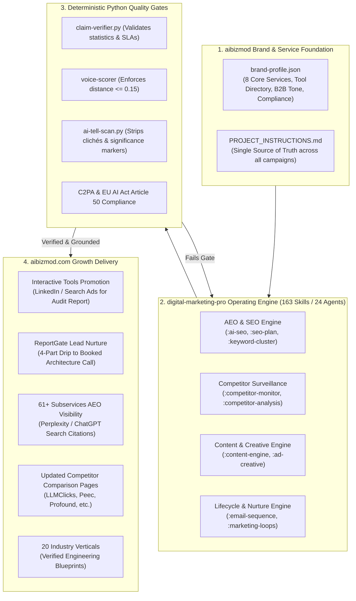

# Comprehensive Strategic Proposal & Action Plan: Adopting `digital-marketing-pro` for aibizmod

**Prepared for:** Executive Management & Marketing Leadership  
**Author:** Engineering & Growth Team  
**Subject:** Full-Platform Implementation of an Open-Source AI Marketing Operating System for [aibizmod.com](https://aibizmod.com)  
**Status:** Ready for Management Review  

---

## 1. Executive Summary

aibizmod has engineered an advanced enterprise technology platform featuring:
* **8 Primary Technology Services & 61+ Subservices** (Agentic AI, LLMs, Custom Software, Cloud/DevOps, IT Consulting, etc.)
* **5 Proprietary Interactive Tools & Calculators** (AI Visibility Audit Report, Automation ROI Calculator, AI Readiness Score, Keyword Research Tool, LLMs.txt Generator)
* **Gated Lead Capture Infrastructure (`ReportGate`)** (OTP authentication gating full assessment reports)
* **5 Competitor Comparison Pages** (Targeting LLMClicks, Peec, Otterly, Profound, and AIClicks)
* **18+ Technical Blog Articles & Methodology Frameworks**
* **20 Specialized Industry Verticals** (`/industries/*`)

While our product and engineering architecture is mature, our **marketing distribution and lead-conversion engine is the primary bottleneck**:
1. **Unmonetized Interactive Tools:** Visitors use our free AI audit and ROI calculators, but there is no automated email follow-up sequence to convert them into high-ticket clients (an item documented as open in `docs/COMPLETED-TASKS.md`).
2. **AI Search & SEO Gaps:** Prospective enterprise buyers are increasingly using Perplexity, ChatGPT Search, and Google AI Overviews to find technology vendors, requiring deep AEO/GEO optimization across our 61+ subservices.
3. **Stale Competitor Comparisons:** Comparison pages against emerging competitors require continuous market surveillance on pricing and feature shifts.
4. **Content Production Scale:** Populating 20 industry verticals with verified technical case studies requires months of senior strategist labor.

**The Solution:** Adopt **`digital-marketing-pro`**, an open-source (MIT licensed) AI marketing operating system with **163 specialized skills, 24 subagents, and 90+ deterministic Python verification scripts**. It enables aibizmod to simultaneously solve lead nurturing, tool promotion, competitor surveillance, AI search optimization, and vertical content scale—at **\$0 software licensing cost** and basic model API spend (~$15–$35 per complete campaign).

---

## 2. Business Case & Multi-Pillar Scope

| Strategic Pillar | What Exists in Our Codebase Today | What `digital-marketing-pro` Delivers | Impact on Growth |
|---|---|---|---|
| **1. Lead Capture & Nurture** | `ReportGate` with OTP authentication for 5 interactive assessment tools; no automated follow-up | Automated multi-touch B2B nurture journeys via `:email-sequence` tailored to assessment results | Converts passive tool users into booked client consultations |
| **2. Core Services (61+ Pages)** | Comprehensive service pages for Agentic AI, LLMs, Cloud Ops, etc. | AI search optimization via `:ai-seo` & `:seo-plan`, entity schema enrichment, and query-answering architecture | Establishes aibizmod as a cited vendor in Perplexity, Claude, and Google AI Overviews |
| **3. Interactive Tool Distribution** | High-utility free tools (`/ai-visibility-audit-report`, ROI Calculator) | Targeted B2B ad campaigns via `:ad-creative` and distribution funnels via `:marketing-loops` | Drives high-volume, low-CPA traffic to our front-end lead funnels |
| **4. Competitor Strategy** | 5 live comparison pages (`llmclicks-alternative`, `peec-alternative`, etc.) | Continuous competitor surveillance via `:competitor-monitor` and gap analysis via `:competitor-analysis` | Keeps comparison pages accurate with real 2026 pricing and win-rate arguments |
| **5. Technical Content & Blog** | 18+ posts; methodology guides | Deep technical whitepapers via `:content-engine` verified by deterministic claim and AI-tell scanners | Builds top-of-funnel organic search authority with zero AI fluff |
| **6. Industry Verticals** | 20 sector landing pages with interactive UI | Sector-specific technical case studies and architectural blueprints | High-relevance landing pages for enterprise vertical buyers |

> [!TIP]
> **Key Financial Takeaway:** Rather than paying \$15,000–\$30,000/month across separate SEO agencies, copywriters, and competitor research tools, `digital-marketing-pro` brings a unified, auditable marketing department directly into our repository at **\$0 licensing fees**.

---

## 3. Platform Architecture & Data Flow

---

## 4. Phased 4-Week Action Plan

### Phase 1: Platform Setup & Multi-Pillar Brand Foundation (Week 1)
* **Goal:** Integrate `digital-marketing-pro` into our environment and establish the full-company brand baseline.
* **Key Tasks:**
  1. Clone `digital-marketing-pro` (v3.31.1) into `tools/digital-marketing-pro` (git-ignored) and verify Python execution scripts.
  2. Codify `aibizmod` master profile covering all 6 functional areas:
     - **Core Service Offerings:** AI Automation (Agentic AI, LLMs, Computer Vision), Custom Engineering, Cloud & DevOps, Digital Growth.
     - **Proprietary Assets:** AI Visibility Audit Report, ROI Calculator, Readiness Score.
     - **Ideal Customer Profile (ICP):** CTOs, VPs of Engineering, Product Leaders, Founders.
     - **Voice & Tone:** Authoritative, direct, senior architectural voice, zero generic AI buzzwords.
     - **Regulatory Guardrails:** US (HIPAA/SOC2/CCPA), EU (GDPR & EU AI Act Article 50), India (DPDPA).
  3. Conduct baseline audit of our current AI visibility (AEO/GEO) across Perplexity, ChatGPT Search, and Google AI Overviews.
* **Deliverables:** `brand-profile.json`, `PROJECT_INSTRUCTIONS.md`, Baseline AEO Scorecard.

---

### Phase 2: Lead Funnel Activation & Core Services AEO Sprint (Week 2)
* **Goal:** Monetize our existing tool traffic and boost search authority on primary services.
* **Key Tasks:**
  1. **Lead Nurture Sequence for `ReportGate`:**
     - Use `/digital-marketing-pro:email-sequence` to build a 4-part automated email nurture journey for users who unlock assessment reports.
     - Drip 1: Immediate architecture summary & assessment score review.
     - Drip 2: Technical case study demonstrating measurable ROI.
     - Drip 3: Frequently asked technical, compliance, and integration questions.
     - Drip 4: Direct invitation to book an architectural consultation.
  2. **AEO / GEO Optimization for Core Services:**
     - Use `/digital-marketing-pro:ai-seo` and `/digital-marketing-pro:seo-plan` to optimize high-margin subservices (`/services/ai-automation/agentic-ai`, `/services/ai-automation/llm`, `/services/software-development`).
     - Enrich JSON-LD schema and entity references to maximize citations in AI answer engines.
  3. **Competitor Comparison Refresh:**
     - Run `/digital-marketing-pro:competitor-analysis` against LLMClicks, Peec, Profound, and Otterly to refresh our 5 comparison pages with current 2026 pricing and feature benchmarks.
* **Deliverables:** Production-ready 4-touch email nurture sequence, refreshed competitor comparison content, enriched subservice AEO metadata.

---

### Phase 3: B2B Multi-Channel Distribution & Vertical Pilot (Week 3)
* **Goal:** Drive qualified enterprise traffic into our interactive tools and test vertical GTM.
* **Key Tasks:**
  1. **Paid Ad Campaigns for Free Tools:**
     - Use `/digital-marketing-pro:ad-creative` to generate 5 high-converting ad variations per platform (LinkedIn Sponsored Content & Google Search Ads) promoting the *Free AI Visibility Audit Report* to CTOs and CMOs.
  2. **Pilot Vertical GTM (Top 3 Sectors):**
     - Execute keyword clustering and content creation for **Healthcare**, **FinTech**, and **Retail/E-Commerce**.
     - Populate case studies, technical blueprints, and FAQs in `src/app/industries/[slug]/page.tsx`.
  3. **Quality Gates & Claims Audit:**
     - Run `/digital-marketing-pro:check` to ensure all ad copy, email copy, and vertical case studies maintain brand voice distance $\le 0.15$ and pass quantitative claim verification.
* **Deliverables:** B2B ad creative repository (LinkedIn/Google), 3 fully populated industry verticals with verified case studies.

---

### Phase 4: Full Portfolio Rollout & Continuous Governance (Week 4)
* **Goal:** Scale across the remaining 17 industry verticals and establish continuous surveillance.
* **Key Tasks:**
  1. Batch-run `/digital-marketing-pro:content-engine` across the remaining 17 industry verticals.
  2. Set up automated competitor tracking using `/digital-marketing-pro:competitor-monitor` to alert our team when competitors change pricing or introduce features.
  3. Establish monthly performance reporting with `/digital-marketing-pro:performance-report`.
* **Deliverables:** 20 fully populated industry pages, ongoing competitor surveillance protocol, monthly reporting framework.

---

## 5. Governance, Quality Assurance & Brand Safety

To safeguard aibizmod's enterprise engineering reputation, the system enforces automated code-level verification:

> [!IMPORTANT]
> **Deterministic Claim Verification (`claim-verifier.py`)**  
> Every quantitative statement (e.g. latency metrics, uptime SLAs, performance multipliers) is verified against real platform data before publication. Any ungrounded claim fails the build.

> [!NOTE]
> **Brand Voice Distance Gate ($\le 0.15$)**  
> Semantic embeddings ensure all copy across ads, emails, and service pages reflects a senior architectural tone. Generic AI clichés and empty marketing hype are automatically purged.

> [!CAUTION]
> **Compliance & Legal Readiness**  
> All generated visual creative briefs include C2PA metadata and EU AI Act Article 50 deepfake disclosure clauses. All lead sequences adhere to GDPR, CCPA, and DPDPA requirements.

---

## 6. Success Metrics & Target KPIs

| KPI Area | 30-Day Target | 90-Day Target | Measurement Tool |
|---|---|---|---|
| **Interactive Tool Lead Conversion** | Wire nurture sequence to 100% of `ReportGate` tools | +25% conversion from tool completion to booked consultation | CRM / PostHog / Form logs |
| **AEO / AI Search Citations** | Indexed in Perplexity & Google AI Mode | Top 3 source citation for custom AI/engineering queries | Monthly AEO Audit |
| **Core Subservice Organic Traffic** | +30% impressions on high-intent service keywords | +100% qualified organic traffic on primary service lines | Google Search Console |
| **Competitor Alternative Page Conversion** | Updated live comparisons on all 5 competitors | +15% conversion rate on `/comparisons/*` alternative pages | Analytics / Inbound leads |
| **Industry Verticals Content Coverage** | 100% (20/20 verticals with deep case studies) | Regular quarterly case study refresh | Site content audits |

---

## 7. Next Steps & Action Required

To initiate **Phase 1** this week:
1. **Management Approval:** Approval of the 4-week multi-pillar rollout scope.
2. **Execution Green Light:** Authorization to install `digital-marketing-pro` into `tools/digital-marketing-pro` and codify the master brand profile.
